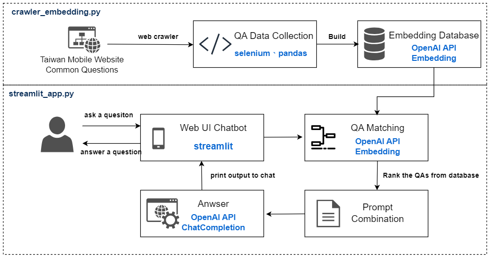

# 📦 OpenAI Customer Service Chatbot

This project try to build up a customer serivce chatbot for taiwan mobile company.  
I use streamlit as my chat interface and openai api as backend.

## Demo App

## GitHub Codespaces

## Architecture

- crawler_embedding.py
  - web crawler from [link](https://www.taiwanmobile.com/cs/public/faq/queryList.htm)
  - save as csv
  - convert to embedding using OpenAI API
- streamlit_app.py
  - main 
  - search similar question from database
  - answer the question

